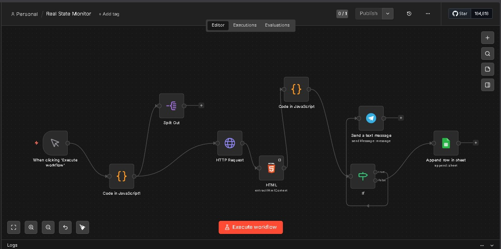

# Real Estate Deal Hunter — Dubizzle Egypt

<div align="center">


[](https://powerbi.microsoft.com/)
[](https://n8n.io/)
[](https://microsoft.com/excel)
[](https://figma.com/)
[](https://dubizzle.com)

**An end-to-end automated real estate intelligence system — scraping Dubizzle Egypt, sending Telegram alerts, and delivering a 4-page Power BI dashboard with custom Figma-designed visuals.**

[📊 Dashboard Pages](#-dashboard-pages) • [⚙️ Workflow](#️-n8n-automation-workflow) • [🚀 Getting Started](#-getting-started)

</div>

---

## Project Overview | نظرة عامة

> **EN:** This project is a full real estate monitoring pipeline built on Dubizzle Egypt. It automatically scrapes property listings, detects new deals, sends instant Telegram notifications, and presents deep market analysis through a professionally designed Power BI dashboard — with a custom background designed in Figma.

> **AR:** المشروع ده نظام متكامل لمراقبة سوق العقارات على Dubizzle مصر. بيشتغل أوتوماتيكي — بيسحب الإعلانات، يكشف الـ good deals، يبعت تنبيهات Telegram فورية، ويعرض تحليل عميق لسوق العقارات من خلال داشبورد Power BI احترافي مع باكجراوند مصمم بـ Figma.

---

## Key Features | المميزات

| Feature | Description |
|---|---|
| 🔄 **Automated Scraping** | Collects live listings from Dubizzle Egypt via HTTP requests |
| 🧠 **Deal Detection** | JavaScript logic classifies listings as Good Deal vs Normal |
| 📲 **Telegram Alerts** | Instant notifications for new properties via Telegram Bot |
| 📊 **4-Page Power BI Report** | Deep market analysis across 4 specialized dashboard pages |
| 🎨 **Custom Figma Design** | Dashboard backgrounds professionally designed in Figma |
| 📁 **Structured CSV Output** | Clean data pipeline ready for analysis |

---

## 🛠️ Tools & Technologies | الأدوات المستخدمة

```
🌐  Dubizzle Egypt     →   Data Source (Live Property Listings)
⚙️  n8n               →   Automation Workflow & Orchestration
💻  JavaScript        →   HTML Parsing & Deal Scoring Logic
📲  Telegram Bot      →   Real-time Deal Alerts
📝  Microsoft Excel   →   Data Cleaning & Preprocessing
🎨  Figma             →   Custom Dashboard Background Design
📊  Power BI          →   4-Page Interactive Dashboard
```

---

## ⚙️ n8n Automation Workflow

<div align="center">



</div>

| Step | Node | Description |
|---|---|---|
| 1 | ⚡ **Trigger** | Manual or scheduled execution |
| 2 | **Code (JS)** | Builds the HTTP request parameters |
| 3 | **Split Out** | Splits listings into individual items |
| 4 | **HTTP Request** | Fetches live data from Dubizzle |
| 5 | **HTML Parser** | Extracts property details from HTML content |
| 6 | **Code (JS)** | Scores and classifies deals (Good / Normal) |
| 7 | **If Node** | Routes new listings vs already-seen ones |
| 8 | **Telegram** | Sends alert message for new good deals |
| 9 | **Google Sheets** | Appends row to the data sheet |

---

## 📊 Dashboard Pages

### Page 1 — Real Estate Deal Hunter
> Identifies good deals vs normal listings across Cairo districts


**KPIs:** Total Listings (1,289) • Good Deals (242) • Avg Price 4.29M • Good Deals 19%

**Visuals:** Price vs Area Scatter • Deal Composition Donut • Top 5 Areas • Top Deals Table

---

### Page 2 — Market Structure Analysis
> Deep dive into market segmentation and property characteristics


**KPIs:** Avg PPM 51.16K • Median Price 7M • Avg Area 167 m² • Luxury Count 179

**Visuals:** Price Segmentation Donut • District Price Ranking • Property Size Mix • Bedroom Distribution

---

### Page 3 — Market Intelligence Hub
> Value-for-money intelligence and district-level opportunity scoring


**KPIs:** Avg Deal Score 4.62 • Cheapest Area R8 • Best Score Mokattam • Last Update 2026-04-10

**Visuals:** Value-for-Money Scatter • Top Districts Ranking • Deal Reasons • Price/m² Matrix

---

### Page 4 — Value Drivers Analysis
> What actually drives property value — bedrooms, bathrooms & size


**KPIs:** Value/Bathroom 3.19M • Value/Bed 2.89M • Beds:Baths Ratio 1.1 • PPM Range 288.43K

**Visuals:** Bed vs Avg PPM • Bathrooms vs PPM • Value Matrix • Price vs Area Bubble Chart

---

## 🎨 Design | التصميم

> Dashboard backgrounds were custom-designed in **Figma** to match the Dubizzle brand identity — using the official red/white color scheme with clean professional layouts, then exported as PNG and embedded directly into Power BI.

---

## Project Structure | هيكل المشروع

```
The-Real-State-Monitor-Dubizzle/
│
├── 📂 Data/
│   └── Dubizzle Properties.csv          # Scraped & cleaned listings
│
├── 📂 Power BI/
│   └── DUBIZZLE.pbix                    # 4-page interactive dashboard
│
├── 📂 n8n/
│   ├── Real State Monitor.json          # Importable n8n workflow
│   └── WorkFlow.jpg                     # Workflow diagram
│
├── 📂 Screenshots/
│   ├── Dashboard_1.jpg                  # Real Estate Deal Hunter
│   ├── Dashboard_2.jpg                  # Market Structure Analysis
│   ├── Dashboard_3.jpg                  # Market Intelligence Hub
│   └── Dashboard_4.jpg                  # Value Drivers Analysis
│
├── 📂 Images/
│   └── ...                              # Figma exports & assets
│
└── README.md
```

---

##  Getting Started | طريقة الاستخدام

###  Import n8n Workflow
```
1. Open your n8n instance
2. Workflows → Import from File
3. Upload: n8n/Real State Monitor.json
4. Add your Telegram Bot Token & Chat ID
5. Connect Google Sheets node to your sheet
6. Activate 
```

###  Open Power BI Dashboard
```
1. Open Power BI Desktop
2. File → Open → Power BI/DUBIZZLE.pbix
3. Update data source path to your CSV
4. Refresh → Explore all 4 pages 
```

---

## 👤 Author | صاحب المشروع

<div align="center">

**Youssef Hossam**
*Freelance Data Analyst | CS Student | Top 94 Data Science Egypt 🇪🇬*

[](https://www.linkedin.com/in/youssef-hossam-eldien)
[](https://github.com/Youssef-Hossam-Eldien)

</div>

---

<div align="center">

⭐ **If you found this useful, drop a star!** ⭐

*Built with ❤️ by Youssef Hossam*

</div>
